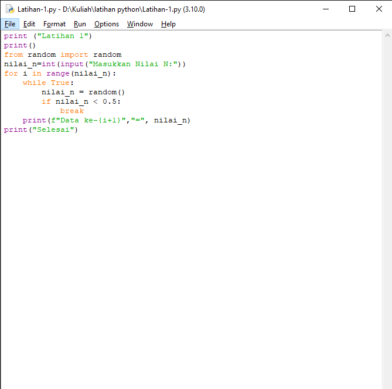
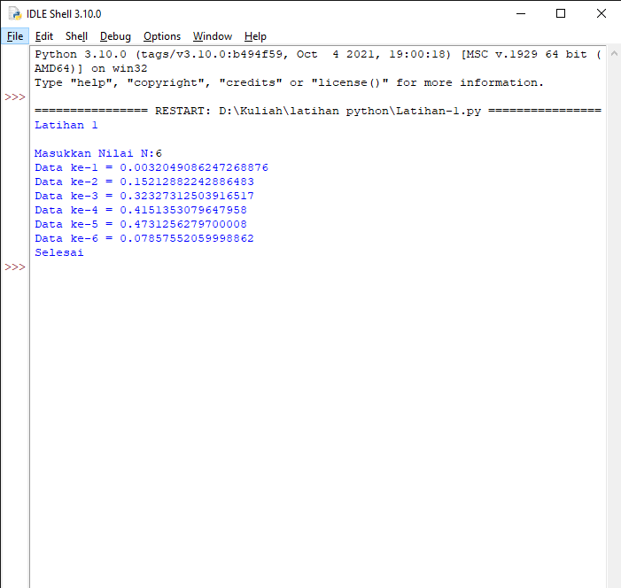

# Tugas Pratikum 3

<h2>Latihan 1</h2>

<ul type=’disc’>
    <li>Tampilkan n bilangan acak yang lebih kecil dari 0.5.</li>
    <li>Nilai n diisi pada saat runtime</li>
    <li>Anda bisa menggunakan kombinasi while dan for untuk menyelesaikannya</li>
    <li>Gunakan fungsi random() yang dapat diimport terlebih dahulu</li>
</ul>

<h3>-Program-</h3>



<h3>Penjelasan :</h3>

1. Karena bilangan acak, maka gunakan fungsi random.
    ```bash
		from random import random
	```

2. Masukkan variable N yang berupa bilangan bulat (integer).
	
    ```bash
		nilai_n=int(input("Masukkan Nilai N:"))
	```
3. Gunakan kombinasi for dan while dimana perulangan for, rangenya menyesuaikan inputan dari "nilai_n". Jika "nilai_n" lebih kecil dari 0.5 maka program terhenti.
	
    ```bash
		for i in range(nilai_n):
    		while True:
       			nilai_n = random()
       			if nilai_n < 0.5:
           			break
	```
4. Menampilkan hasil output
	```bash
		    print(f"Data ke-{i+1}","=", nilai_n)
        print("Selesai")	
	```
<h3>-Output Program-</h3>



<h2>Latihan 2</h2>

<ul type=’disc’>
    <li>Membuat program untuk menampilkan bilangan terbesar dari N buah data yang diinputkan.</li>
    <li>Masukkan angka 0 untuk berhenti</li>
</ul>

<h3>-Program-</h3>

![img] screenshot/

<h3>Penjelasan :</h3>

<h3>-Output Program-</h3>

![img] screenshot/

<h2>Program 1</h2>

<p>Buat program sederhana dengan perulangan: 
Seorang pengusaha menginvestasikan uangnya untuk memulai usahanya dengan
modal awal 100 juta, pada bulan pertama dan kedua belum mendapatkan laba. pada
bulan ketiga baru mulai mendapatkan laba sebesar 1% dan pada bulan ke 5,
pendapatan meningkat 5%, selanjutnya pada bulan ke 8 mengalami penurunan
keuntungan sebesar 2%, sehingga laba menjadi 3%. Hitung total keuntungan selama 8
bulan berjalan usahanya.</p>

<h3>-Program-</h3>

![img] screenshot/

<h3>Penjelasan :</h3>

<h3>-Output Program-</h3>

![img] screenshot/
