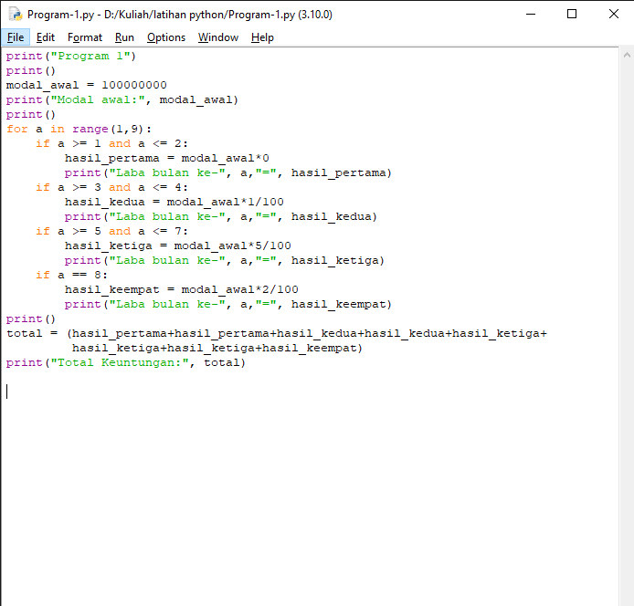

# Tugas Pratikum 3

<h2>Latihan 1</h2>

<ul type=’disc’>
    <li>Tampilkan n bilangan acak yang lebih kecil dari 0.5.</li>
    <li>Nilai n diisi pada saat runtime</li>
    <li>Anda bisa menggunakan kombinasi while dan for untuk menyelesaikannya</li>
    <li>Gunakan fungsi random() yang dapat diimport terlebih dahulu</li>
</ul>

<h3>-Program-</h3>


<h3>Penjelasan :</h3>

1. Karena bilangan acak, maka gunakan fungsi random.
    ```bash
		from random import random
	```

2. Masukkan variable N yang berupa bilangan bulat (integer).
	
    ```bash
		nilai_n=int(input("Masukkan Nilai N:"))
	```
3. Gunakan kombinasi for dan while dimana perulangan for, rangenya menyesuaikan inputan dari "nilai_n". Jika "nilai_n" lebih kecil dari 0.5 maka program terhenti.
	
    ```bash
		for i in range(nilai_n):
    		while True:
       			nilai_n = random()
       			if nilai_n < 0.5:
           			break
	```
4. Menampilkan hasil output
	```bash
		    print(f"Data ke-{i+1}","=", nilai_n)
        print("Selesai")	
	```
<h3>-Output Program-</h3>


<h2>Latihan 2</h2>

<ul type=’disc’>
    <li>Membuat program untuk menampilkan bilangan terbesar dari N buah data yang diinputkan.</li>
    <li>Masukkan angka 0 untuk berhenti</li>
</ul>

<h3>-Program-</h3>


<h3>Penjelasan :</h3>

1. Agar dapat melakukan pengulangan secara terus menerus selama kondisi bernilai "True", gunakan <b>while</b>.

    ```bash
        while True:
    ```

2. Masukkan variable bilangan bulat (integer).

    ```bash
        angka = int(input("Masukkan Angka:"))
    ```

3. Jika "a" (nilai a = 0) kurang dari "angka" (variable input) dan "a" bernilai sama dengan "angka", maka program akan terus berjalan. 

    ```bash
        if a < angka:
                a = angka
    ```
4. Jika "angka" nilainya sama dengan "0" maka program akan terhenti.

    ```bash
        if angka == 0:
                break
    ```
5. Hasil output angka terbesar.

    ```bash
        print("Angka Terbesar:", a)
    ```

<h3>-Output Program-</h3>


<h2>Program 1</h2>

<p>Buat program sederhana dengan perulangan: 
Seorang pengusaha menginvestasikan uangnya untuk memulai usahanya dengan
modal awal 100 juta, pada bulan pertama dan kedua belum mendapatkan laba. pada
bulan ketiga baru mulai mendapatkan laba sebesar 1% dan pada bulan ke 5,
pendapatan meningkat 5%, selanjutnya pada bulan ke 8 mengalami penurunan
keuntungan sebesar 2%, sehingga laba menjadi 3%. Hitung total keuntungan selama 8
bulan berjalan usahanya.</p>

<h3>-Program-</h3>



<h3>Penjelasan :</h3>

1. Menampilkan modal awal.

    ```bash
        modal_awal = 100000000
        print("Modal awal:", modal_awal)
    ```
2. Melakukan perulangan variable a dengan range 1-9.

    ```bash
        for a in range(1,9):
    ```

3. Menghitung laba dari bulan pertama hingga bulan kedelapan.

    ```bash
            if a >= 1 and a <= 2:
                hasil_pertama = modal_awal*0
                print("Laba bulan ke-", a,"=", hasil_pertama)
            if a >= 3 and a <= 4:
                hasil_kedua = modal_awal*1/100
                print("Laba bulan ke-", a,"=", hasil_kedua)
            if a >= 5 and a <= 7:
                hasil_ketiga = modal_awal*5/100
                print("Laba bulan ke-", a,"=", hasil_ketiga)
            if a == 8:
                hasil_keempat = modal_awal*2/100
                print("Laba bulan ke-", a,"=", hasil_keempat)
    ```

4. Menjumlahkan total keuntungan dari laba yang didapat, dari bulan pertama hingga bulan kedelapan. Untuk menghitungnya sesuaikan dengan script code yang dilakukan pada program perulangan.

    ```bash
        total = (hasil_pertama+hasil_pertama+hasil_kedua+hasil_kedua+hasil_ketiga+hasil_ketiga+hasil_ketiga+hasil_keempat)
        print("Total Keuntungan:", total)
    ```

<h3>-Output Program-</h3>

![img] screenshot/


<h3>Sekian Terimakasih</h3>